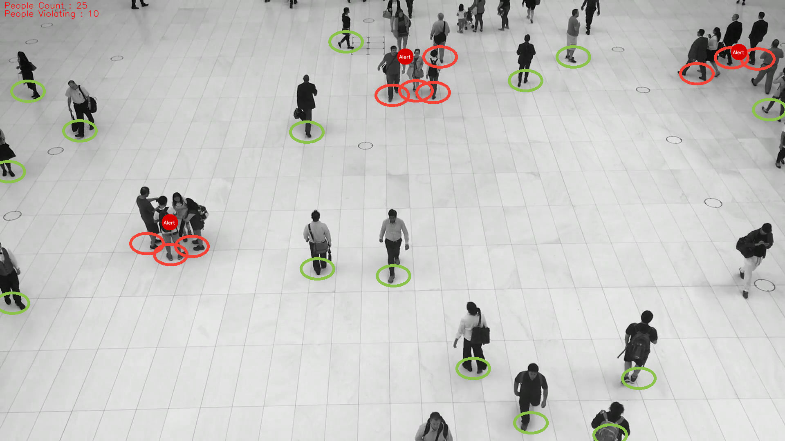
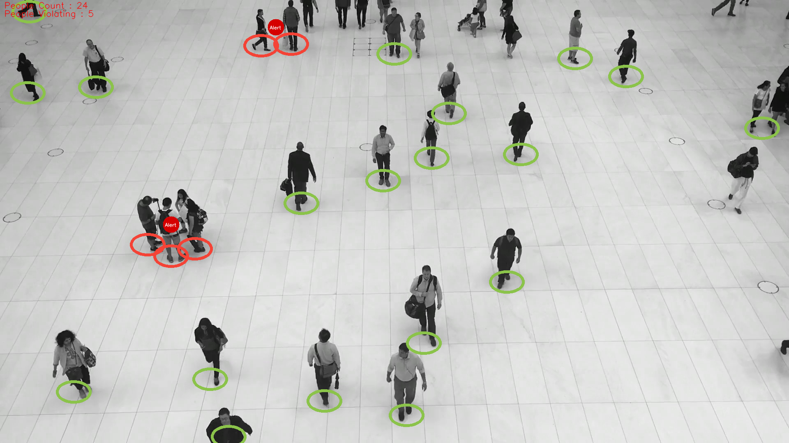
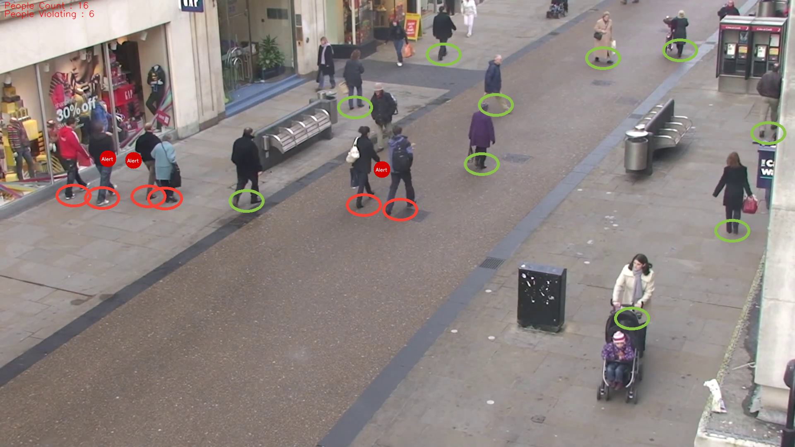

# COVID19-Social-Distancing-Voilation-Detector-Using-YOLOv5

Python implementation of YOLO v5 to detect if people are maintaining social distancing in public places.

Usage:

python3 detector.py --source [input file or webcam id] --yolo_model yolov5s

## RESULTS

1. Mall scenario

2. People walking in a busy street

