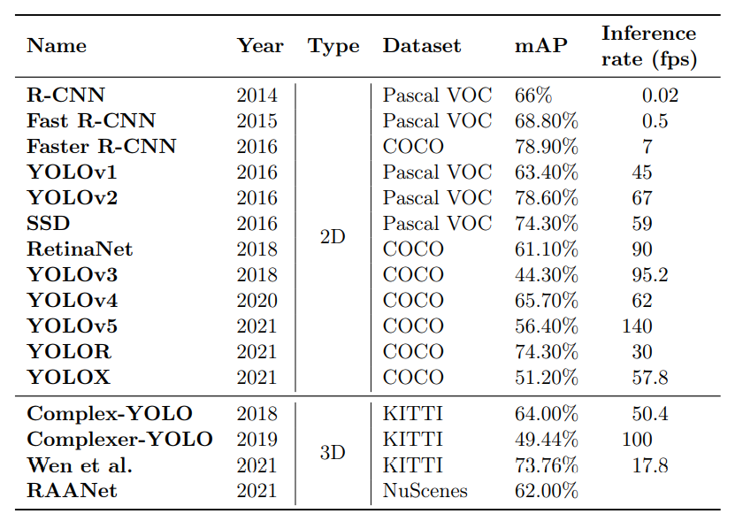
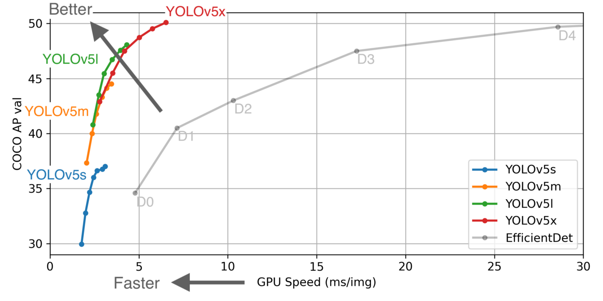

# COVID19-Social-Distancing-Voilation-Detector-Using-YOLOv5

Python implementation of YOLO v5 to detect if people are maintaining social distancing in public places.

## ABOUT YOLO v5
YOLO an acronym for 'You only look once', is an object detection algorithm that divides images into a grid system. Each cell in the grid is responsible for detecting objects within itself.YOLO is one of the most famous object detection algorithms due to its speed and accuracy.

The YOLOv5 implementation has been done in Pytorch in contrast with the previous developments that used the DarkNet framework. This makes it easier to understand, train with it and deploy this model.

## YOLOv5 variants
YOLOv5 is available in four models, namely s, m, l, and x, each one of them offering different detection accuracy and performance as shown below.

## RESULTS

1. Mall scenario

2. People walking in a busy street

## INSTRUCTIONs:
1. git clone git@github.com:vaishanth-rmrj/COVID19-Social-Distancing-Voilation-Detector-Using-YOLOv5.git
2. python3 detector.py --source inputs/mall_area.mp4 --yolo_model yolov5s

